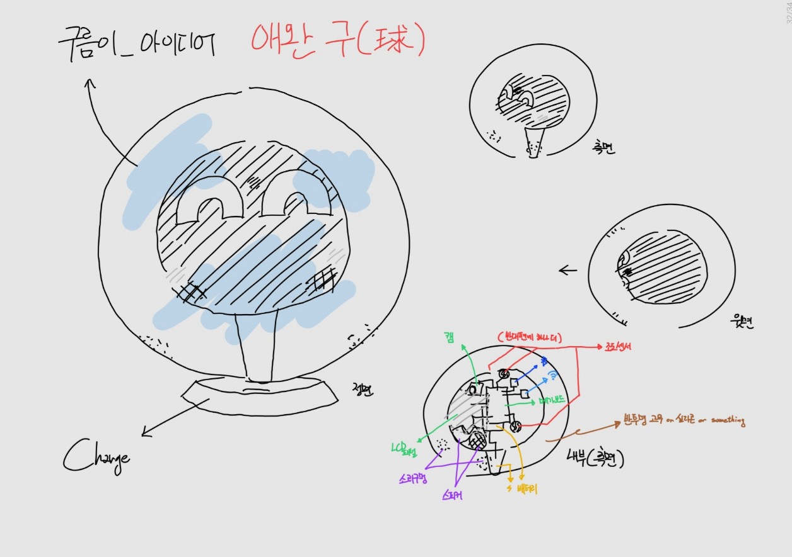
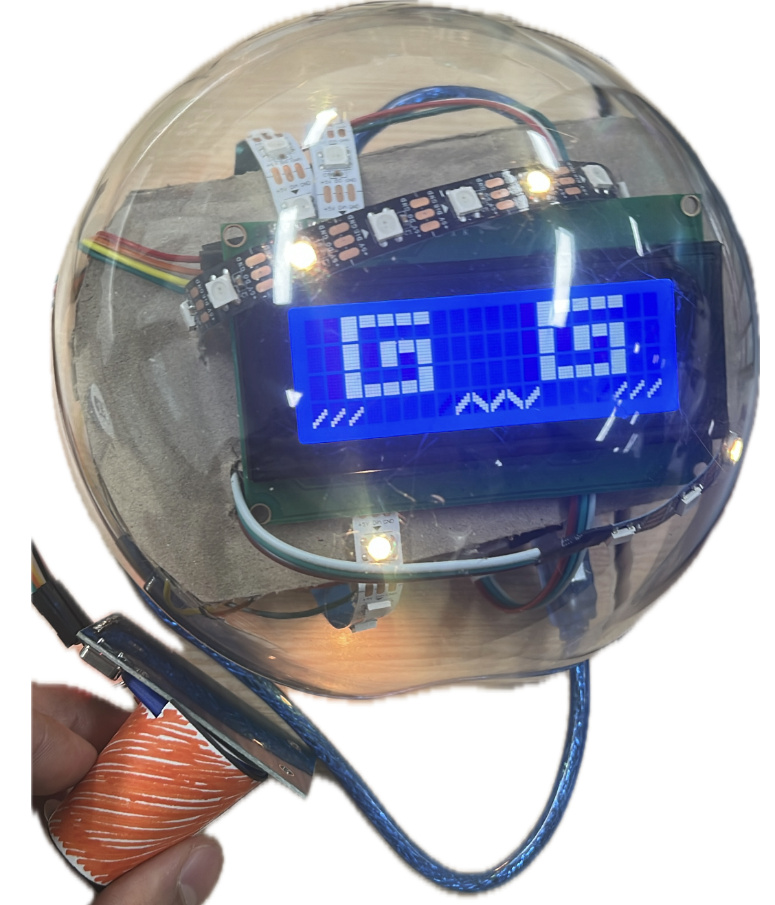

# goormi-robot
> 사람의 감정에 반응하는 애완 로봇 "구름이"

```**2024 SMARTJON 1등 수상작**```

 |
--- | --- | 


## About Project
- 카메라를 통해 사람의 감정을 확인하고 그에 맞는 상호작용을 한다.
- 조도센서를 통해 촉각을 대신하여 사람의 터칭을 감지한다.
- RFID 센서로, 식사, 음료 등의 효과를 대신 구현하였다. (다마고치)

## Hardware
- LCD 7인치 디스플레이
- 조도센서
- Arduino Uno
- blutooth 통신 센서
- Neo Pixel LED strip

## Software
- Arduino (c)
- python (pytorch, mediapipe)

## Developer
- 세종대학교 지능기전공학부 19 이용빈
- 세종대학교 지능기전공학부 21 현희섭
- 세종대학교 지능기전공학과 23 박신영
- 세종대학교 지능기전공학부 23 조예림